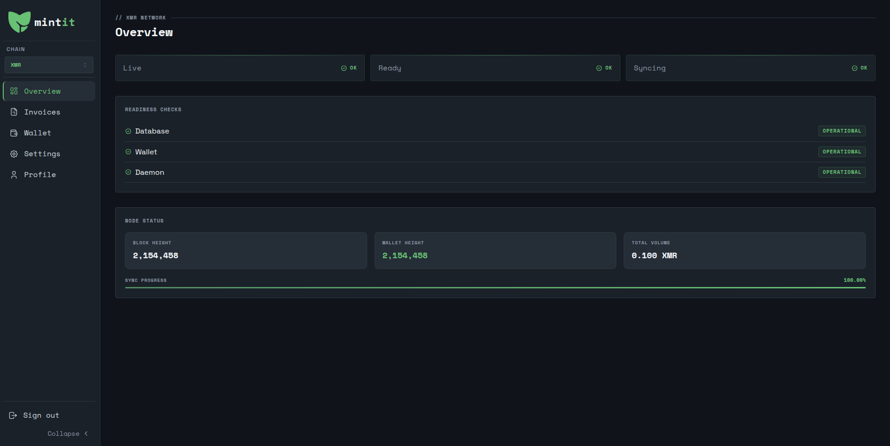

---

### A self-hosted payment processor for privacy-focused cryptocurrencies. Accepts payments in fixed fiat amounts and notifies your application via webhooks. Currently supports Firo and Monero. Currently in progress.

## 📚 Current docs: **[mintit.dev](https://mintit.dev)**

## Roadmap

### Phase 1 — Core Payment Processor

- [x] Invoice-based payments with unique address per invoice
- [x] Multi-chain support (Firo, XMR)
- [x] Authenticated webhooks
- [x] Admin dashboard
- [x] Docker deployment

### Phase 2 — Merchant Focus

- [x] 2FA
- [x] Per-invoice coin selection
- [x] Invoice memos
- [ ] Manager and admin roles
- [ ] Additional privacy coin support
- [ ] Configurable coin price sources
- [ ] Underpayment threshold

### Phase 3 — Developer Experience (TBD)
