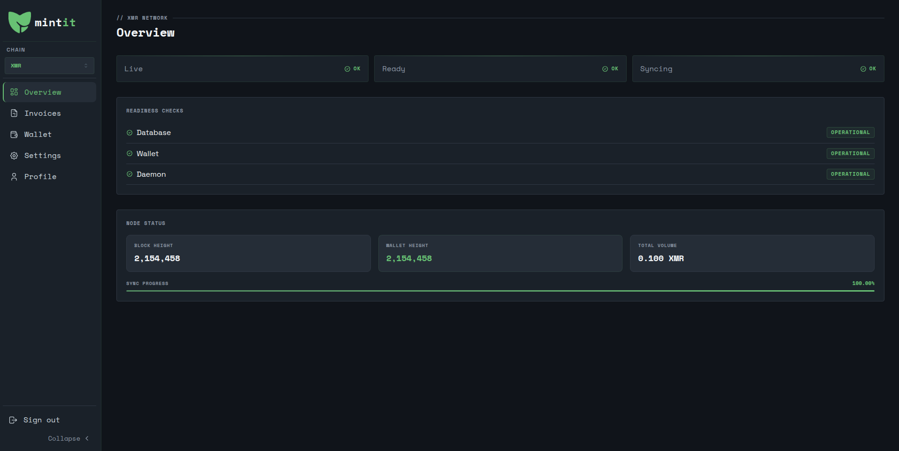

---

### A self-hosted payment processor for privacy-focused cryptocurrencies. Accepts payments in fixed fiat amounts and notifies your application via webhooks. Currently supports Firo, Monero, and Pivx.

## 📚 Current docs: **[mintit.dev](https://mintit.dev)**



## 🚧 Under construction: no image has been published to Docker Hub yet; build from source for evaluation using docker compose.

### Bring your own node

`docker-compose.yml` doesn't bundle `monerod`/`firod`/`pivxd` — point the `*_DAEMON_URI` / `*_RPC_HOST` vars in `.env` at a node you already run. If that node also runs in Docker, attach it to the `mint_net` network so `mint_web` can reach it by container name:

```yaml
services:
  your_node:
    networks:
      - mint_net

networks:
  mint_net:
    external: true
```

## Development

### Dev mode (hot reload)

```bash
cp .env.example.dev .env.local   # fill in RPC creds, etc.
pnpm install
pnpm dev
```

Runs the API and web app directly via `turbo run dev`, reading config from `.env.local`.

### Docker demo (Caddy + built image)

```bash
cp .env.example.prod .env        # fill in every blank
docker compose up -d
```

Builds the app image from the root `Dockerfile` (multi-stage: builds `@mintit/types`, `@mintit/api`, `@mintit/web`, then serves the API + built SPA from one Node process) and fronts it with Caddy for TLS termination, alongside a Postgres container. See `docker-compose.yml` for the full service layout.
